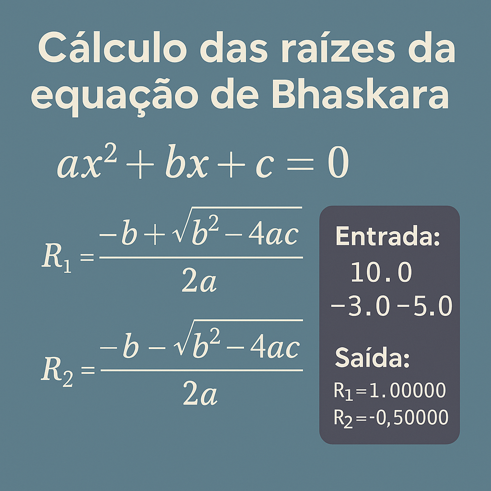

# Cálculo das raízes da equação de Bhaskara

Este projeto em C# realiza o cálculo das raízes de uma equação do segundo grau utilizando a fórmula de Bhaskara. Ele faz parte de uma série de exercícios voltados para reforçar o entendimento de lógica de programação e operações matemáticas.

## 💡 Lógica Implementada

A equação do segundo grau possui a forma:

ax² + bx + c = 0

css
Copiar
Editar

As raízes são calculadas com a fórmula de Bhaskara:

delta = b² - 4ac

r1 = (-b + √delta) / (2a) r2 = (-b - √delta) / (2a)

markdown
Copiar
Editar

### ⚠️ Regras de Validação

- Se `a == 0` ou `delta < 0`, a equação não possui raízes reais e é exibida a mensagem: `Impossivel calcular`.
- Se `delta > 0` e `a ≠ 0`, são exibidas as duas raízes com 5 casas decimais.

## 🧪 Exemplo de Entrada

10 20 10

shell
Copiar
Editar

## 🧾 Exemplo de Saída

R1 = -1.00000 R2 = -1.00000

markdown
Copiar
Editar

## 🛠️ Tecnologias Utilizadas

- C#
- .NET Core 3.1
- Visual Studio

## 📂 Estrutura do Projeto

├── Calculo_das_raizes_da_equação_de_Bhaskara.sln └── Calculo_das_raizes_da_equação_de_Bhaskara/ ├── Calculo_das_raizes_da_equação_de_Bhaskara.csproj └── Program.cs

yaml
Copiar
Editar

## 📸 Ilustração

A imagem de capa representa visualmente o conceito de resolução de equações matemáticas, focando na fórmula de Bhaskara.

---

Desenvolvido para fins educacionais ✨
